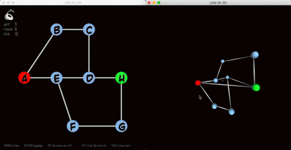
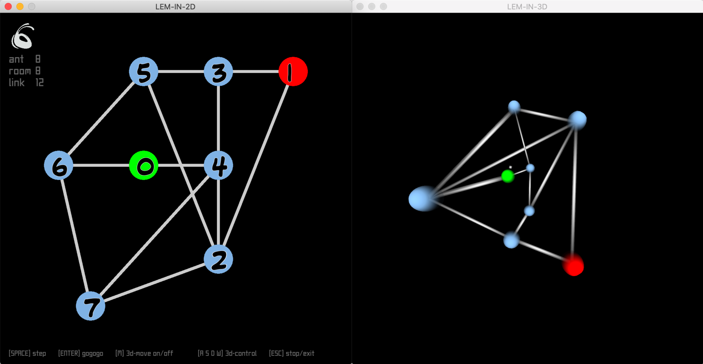
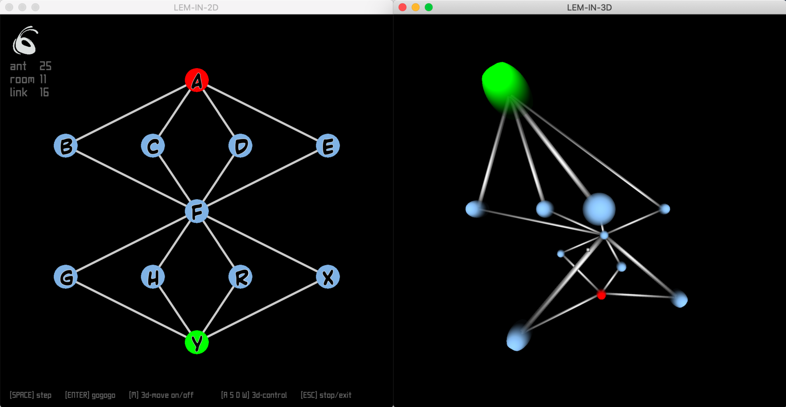

# Find the quickest way to get N elements across the graph

This project is about finding the optimal flow of ants through an anthill that minimizes the number of steps needed to traverse the anthill.



An anthill is described as undirected unweighted graph. It is composed of rooms (graph nodes) which can contain only one ant at a time (except room "start" and "end"), and tunnels (edges) linking thoses rooms. The goal is to move all ants from the room "start" to the room "end" in the minimum of moves possible.

## Input

Program receives the data describing the anthill from the external map-file in the following format
```
8					<- ants number
##start				<- start room is following
1 23 3				<- room name and coordinates
2 16 7
#comment			<- optional comment
3 16 3
4 16 5
5 9 3
6 1 5
7 4 8
##end				<- end room is following
0 9 5
0-4					<- link
0-6
1-3
4-3
5-2
3-5
#another comment
4-2
2-1
7-6
7-2
7-4
6-5
#another comment
```

Which corresponds to the following representation
```
              _______________
             /               \ 
     ______[5]----[3]----[1]  | 
    /              |     /    | 
   [6]-----[0]----[4]  /      | 
    \   _________/ |  /       |
     \ /          [2]/_______/ 
      [7]_________/
```

## Output

At each turn we display the ants that moved, we can move each ant only once and through a tube (the room at the receiving end must be empty).
Output format: Lx-a Ly-b Lz-c ...
x, y, z represents the ants’ numbers
a, b, c represents the rooms’ names
```
L1-2 L2-3
L1-5 L2-4 L3-2 L4-3
L1-6 L2-0 L3-5 L4-4 L5-2 L6-3
L1-0 L3-6 L4-0 L5-5 L6-4 L7-3
L3-0 L5-6 L6-0 L7-4 L8-3
L5-0 L7-0 L8-4
L8-0
```

## Visualizer

It is possible to pass solver output to visualizer to see graphical representation in 2d and 3d






## Basics

- GCC
- OpenGL 2.1
- GLSL 1.20

## Dependencies

- glew 2.1.0
- sfml 2.5.1

## Install
```
git clone https://github.com/gitEllE-if/graph_flow_visu.git graphSolve
cd graphSolve
make
```
I only tested and run this program on MacOS (Mojave, HighSierra, Catalina)

## Usage

- output to console
```
./solve < map_file
```
- output to visualizer
```
./solve < map_file | ./visu
```
example: `./solve map/example | ./visu`

- `[M]` - 3d move on/off
- `[P]` - draw path on/off
- `[ASDW mouse]` - camera control
- `[1 2]` - room size
- `[ESC]` - exit/stop

### Authors: 

- solver - [Phill](https://github.com/PhilippNox)
- visualizer - me :)
